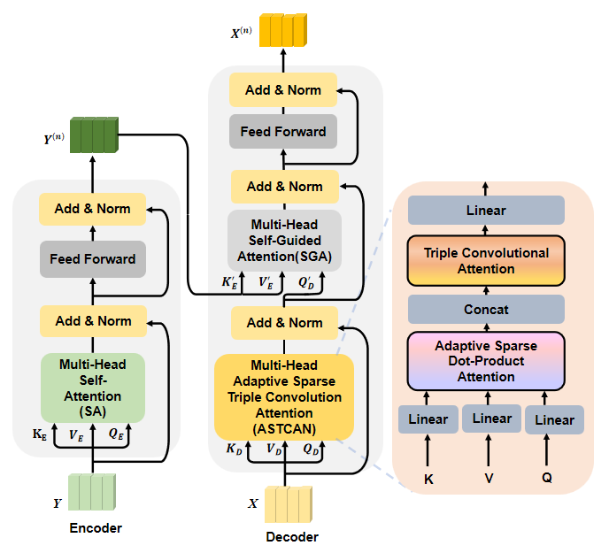

# ASTCAN



## Prerequisites

#### Setup 

 The image features are extracted using the [bottom-up-attention](https://github.com/peteanderson80/bottom-up-attention) strategy, with each image being represented as an dynamic number (from 10 to 100) of 2048-D features. We store the features for each image in a `.npz` file. You can prepare the visual features by yourself or download the extracted features from [OneDrive](https://awma1-my.sharepoint.com/:f:/g/personal/yuz_l0_tn/EsfBlbmK1QZFhCOFpr4c5HUBzUV0aH2h1McnPG1jWAxytQ?e=2BZl8O) or [BaiduYun](https://pan.baidu.com/s/1C7jIWgM3hFPv-YXJexItgw#list/path=%2F). The downloaded files contains three files: **train2014.tar.gz, val2014.tar.gz, and test2015.tar.gz**, corresponding to the features of the train/val/test images for *VQA-v2*, respectively. You should place them as follows:

```angular2html
|-- datasets
	|-- coco_extract
	|  |-- train2014.tar.gz
	|  |-- val2014.tar.gz
	|  |-- test2015.tar.gz
```

Besides, we use the VQA samples from the [visual genome dataset](http://visualgenome.org/) to expand the training samples. Similar to existing strategies, we preprocessed the samples by two rules:

1. Select the QA pairs with the corresponding images appear in the MSCOCO train and *val* splits.
2. Select the QA pairs with the answer appear in the processed answer list (occurs more than 8 times in whole *VQA-v2* answers).

For convenience, we provide our processed vg questions and annotations files, you can download them from [OneDrive](https://awma1-my.sharepoint.com/:f:/g/personal/yuz_l0_tn/EmVHVeGdck1IifPczGmXoaMBFiSvsegA6tf_PqxL3HXclw) or [BaiduYun](https://pan.baidu.com/s/1QCOtSxJGQA01DnhUg7FFtQ#list/path=%2F), and place them as follow:


```angular2html
|-- datasets
	|-- vqa
	|  |-- VG_questions.json
	|  |-- VG_annotations.json
```

After that, you can run the following script to setup all the needed configurations for the experiments

```bash
$ sh setup.sh
```

Running the script will: 

1. Download the QA files for [VQA-v2](https://visualqa.org/download.html).
2. Unzip the bottom-up features

## Training

The following script will start training with the default hyperparameters:

```bash
$ python3 run.py --RUN='train'
```
All checkpoint files will be saved to:

```
ckpts/ckpt_<VERSION>/epoch<EPOCH_NUMBER>.pkl
```

and the training log file will be placed at:

```
results/log/log_run_<VERSION>.txt
```

#### Offline Evaluation

Offline evaluation only support the VQA 2.0 *val* split. If you want to evaluate on the VQA 2.0 *test-dev* or *test-std* split, please see [Online Evaluation](#Online-Evaluation).

There are two ways to start:

(Recommend)

```bash
$ python3 run.py --RUN='val' --CKPT_V=str --CKPT_E=int
```

or use the absolute path instead:

```bash
$ python3 run.py --RUN='val' --CKPT_PATH=str
```


#### Online Evaluation

The evaluations of both the VQA 2.0 *test-dev* and *test-std* splits are run as follows:

```bash
$ python3 run.py --RUN='test' --CKPT_V=str --CKPT_E=int
```

Result files are stored in ```results/result_test/result_run_<'PATH+random number' or 'VERSION+EPOCH'>.json``` ,and you should unzip and put them to the correct folders as follows:

```angular2html
|-- ckpts
	|-- ckpt_small
	|  |-- epoch13.pkl
	|-- ckpt_large
	|  |-- epoch13.pkl

```

